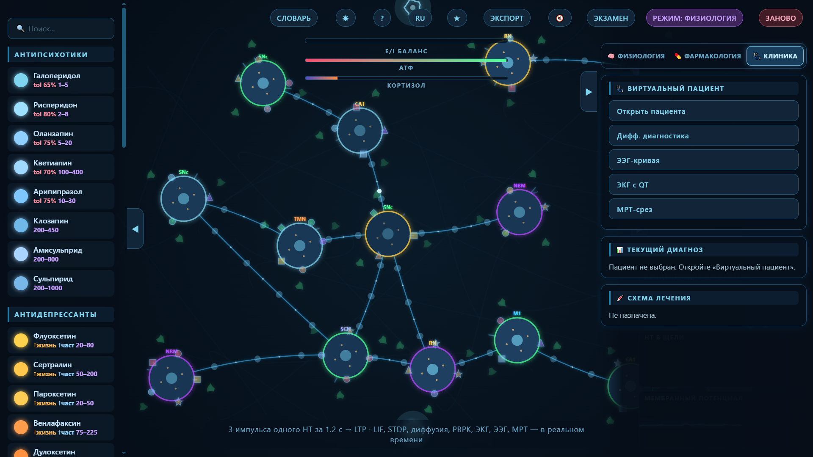

# 🧠 Neuropolygon 4.0 — Interactive Neuropharmacology Simulator

> An interactive, browser-based sandbox for neuroscience and pharmacology education.
> Drag neurotransmitters between neurons, trigger synaptic plasticity, prescribe drugs,
> and watch the effects unfold in real time on EEG, ECG, and MRI.

---



## 📖 Table of Contents

- [What is Neuropolygon?](#-what-is-neuropolygon)
- [Features](#-features)
- [Scientific Foundation](#-scientific-foundation)
- [How to Run](#-how-to-run)
- [Controls](#-controls)
- [Interface Overview](#-interface-overview)
- [Drug Library](#-drug-library)
- [Neurotransmitters](#-neurotransmitters)
- [Receptors](#-receptors)
- [Pathology Modes](#-pathology-modes)
- [Clinical Tools](#-clinical-tools)
- [Technical Stack](#-technical-stack)
- [Architecture](#-architecture)
- [Roadmap](#-roadmap)
- [Contributing](#-contributing)
- [License](#-license)
- [Acknowledgments](#-acknowledgments)

---

## 🧠 What is Neuropolygon?

**Neuropolygon 4.0** is an interactive neuropharmacology simulator that runs entirely in the browser. It combines:

- A **computational model of a neuron** (Leaky Integrate-and-Fire with STDP, homeostasis, and metaplasticity)
- A **neurotransmitter system** with 20+ signaling molecules and 30+ receptor types
- A **pharmacology engine** with 40+ real drugs, their mechanisms, Ki values, therapeutic windows, and CYP-mediated metabolism
- A **PBPK model** (physiologically based pharmacokinetics) with plasma → brain → effect compartments
- **Clinical simulation tools**: virtual patients, differential diagnosis, EEG spectrum, ECG with QT interval, and MRI slice rendering
- **Real-time visualization**: membrane potential, synaptic concentration, PK curves, E/I balance, cortisol, ATP, and more

It is designed for:

- 🎓 **Students** of neuroscience, pharmacology, and medicine
- 👨‍⚕️ **Clinicians** who want to explore drug mechanisms interactively
- 🔬 **Researchers** looking for a teaching or prototyping tool
- 🧑‍🏫 **Educators** who need an engaging classroom demo
- 🎮 **Anyone** curious about how the brain works — and how drugs change it

---

## ✨ Features

### 🧬 Neurophysiology
- **LIF neuron model** — Leaky Integrate-and-Fire with configurable time constants, thresholds, and refractory periods
- **Neuron classes** — regular-spiking, fast-spiking, bursting
- **STDP** — Spike-Timing-Dependent Plasticity with LTP/LTD windows, homeostasis, and metaplasticity
- **Diffusion field** — 2D diffusion of neurotransmitters using a finite-difference solver
- **Kuramoto oscillations** — theta (4–8 Hz) and gamma (30–80 Hz) synchronization with coupling index
- **Second messengers** — cAMP, PKA, CREB, IP₃, DAG, intracellular Ca²⁺
- **Neurotransmitter lifecycle** — vesicle docking, exocytosis, cleft diffusion, reuptake, degradation
- **Dendritic spines** — activity-dependent growth (structural plasticity)
- **Myelinated axons** — with nodes of Ranvier and saltatory conduction animation

### 💊 Pharmacology
- **40+ drugs** across 8 categories (antipsychotics, antidepressants, anxiolytics, stimulants, anticonvulsants, mood stabilizers, dopamine agonists, antimigraine)
- **Real mechanisms of action** — receptor targets, actions (agonist, antagonist, blocker, partial agonist), and Ki values
- **PBPK model** — plasma, brain, and effect compartments with ka, ke, k_brain, k_out
- **CYP450 metabolism** — CYP1A2, CYP2C9, CYP2C19, CYP2D6, CYP3A4 with competition detection
- **Genotype support** — CYP2D6 poor / normal / ultra-rapid metabolizer with T½ multipliers
- **Drug–drug interactions** — serotonin syndrome (SSRI + MAOI), hypertensive crisis (TCA + MAOI), CYP competition
- **Side effects** — extrapyramidal symptoms (D2 blockade), anticholinergic syndrome (M1), sedation (H1), QT prolongation
- **Tolerance and withdrawal** — receptor desensitization and downregulation over repeated use
- **Prodrugs** — e.g., levodopa → dopamine
- **Therapeutic windows** — with real plasma concentration ranges

### 🩺 Clinical Tools
- **Virtual patients** — with complaints, history, examination, labs, differential diagnosis, and treatment
- **Differential diagnosis panel** — realistic clinical reasoning scenarios
- **EEG viewer** — full-window EEG curve with delta, theta, alpha, beta, gamma bands
- **ECG viewer** — with QT interval, heart rate, and arrhythmia risk assessment
- **MRI viewer** — real anatomical slice via [NiiVue](https://github.com/niivue/niivue) (MNI152 template) with a custom simulation overlay showing pathology, drug activity, E/I balance, cortisol, and ATP

### 🎨 Interface
- **Three-panel layout** — drug library (left), simulation canvas (center), monitoring panel (right)
- **Real-time graphs** — membrane potential, neurotransmitter histogram, PK curves, EEG spectrum, heatmap, minimap, event timeline
- **Interactive tooltips** — for drugs, neurotransmitters, and receptors
- **Dark and light themes**
- **Russian and English localization**
- **Achievements system** — 50+ unlockable achievements
- **Exam mode** — auto-generated quizzes on receptors and drugs
- **Glossary** — searchable list of key terms
- **Drug comparison** — side-by-side table of active drugs
- **Export/import** — JSON state export
- **Favorites** — mark drugs for quick access (hotkeys 1–9)
- **Sound effects** — for LTP, LTD, drug application (Web Audio API)

---

## 🔬 Scientific Foundation

The simulation is grounded in established neuroscience and pharmacology literature.

### Neuron Model
- **Leaky Integrate-and-Fire (LIF):**
  τ · dV/dt = −(V − V_rest) + R·I
- **Spike-Timing-Dependent Plasticity (STDP):**
  Δw = A₊ · exp(−Δt/τ₊) for pre→post
  Δw = −A₋ · exp(Δt/τ₋) for post→pre
- **Kuramoto model** for coupled oscillators.

### Key References
- Kandel, E. R. et al. *Principles of Neural Science*, 6th ed.
- Lüscher, C. & Malenka, R. C. (2012). *NMDA receptor-dependent long-term potentiation and long-term depression*. Cold Spring Harb Perspect Biol.
- Niswender, C. M. & Conn, P. J. (2010). *Metabotropic glutamate receptors*. Annu Rev Pharmacol Toxicol.
- Stahl, S. M. *Stahl's Essential Psychopharmacology*, 4th ed.
- Sieghart, W. (2015). *Allosteric modulation of GABA-A receptors*. Adv Pharmacol.
- Beaulieu, J. M. & Gainetdinov, R. R. (2011). *The physiology, signaling, and pharmacology of dopamine receptors*. Pharmacol Rev.
- Fredholm, B. B. et al. (2001). *International Union of Pharmacology. XXV. Nomenclature and classification of adenosine receptors*. Pharmacol Rev.
- Wess, J. et al. (2007). *Muscarinic acetylcholine receptors*. Physiol Rev.
- Torres, G. E. et al. (2003). *Plasma membrane monoamine transporters*. Nat Rev Neurosci.
- Barnes, N. M. et al. (2009). *The 5-HT3 receptor*. Neuropharmacology.

> Full reference list is embedded in the source code (each receptor and drug has a `source` field).

---

## 🚀 How to Run

### Option 1: Open the file
1. Download `neuropolygon.html`
2. Double-click it — it opens in any modern browser
3. That's it.

### Option 2: Host it
1. Upload `neuropolygon.html` to any static hosting (GitHub Pages, Netlify, Vercel, etc.)
2. Share the URL

### Requirements
- A modern browser (Chrome, Firefox, Safari, Edge — last 2 versions)
- No installation, no dependencies, no build step
- Internet connection **only** for the optional MRI viewer (loads MNI152 template via NiiVue CDN)

---

## 🎮 Controls

| Action | Control |
|--------|---------|
| Drag neurotransmitter | Click/touch a ball inside a neuron, drag to another neuron |
| Pan the scene | Right-click drag / middle-click drag / hold `Space` + drag |
| Inspect receptor | Hover over a receptor |
| Inspect neurotransmitter | Hover over a ball or a flying vesicle |
| Inspect drug | Hover over a drug in the left panel |
| Add to favorites | Right-click a drug |
| Apply favorite drug | Keys `1` – `9` |
| Pause / resume | `Space` |
| Restart | `R` |
| Cycle mode | `M` |
| Exam | `E` |
| Glossary | `G` |
| Help | `H` |
| Language toggle | `L` |
| Theme toggle | `T` |
| Compare drugs | `C` |
| Virtual patient | `P` / `V` |
| Differential diagnosis | `D` |
| EEG curve | `N` |
| ECG with QT | `B` |
| MRI slice | `J` |
| Screenshot | `S` |

---

## 🖥️ Interface Overview
┌─────────────────────────────────────────────────────────────┐
│ TOP: status bar (score, goal, mode, level) + toolbar │
├───────────┬─────────────────────────────────┬───────────────┤
│ LEFT: │ CENTER: simulation canvas │ RIGHT: │
│ Drug │ + E/I balance bar │ Monitoring │
│ library │ + ATP bar │ panel 4.0 │
│ (200px) │ + cortisol bar │ (340px) │
│ │ + 7 real-time graphs │ │
├───────────┴─────────────────────────────────┴───────────────┤
│ BOTTOM: hint bar │
└─────────────────────────────────────────────────────────────┘

### Monitoring Panel Tabs
1. **🧠 Physiology** — LIF, STDP, diffusion, second messengers, oscillations
2. **💊 Pharmacology** — PBPK, CYP metabolism, interactions, side effects, genotype
3. **🩺 Clinic** — virtual patient, differential diagnosis, EEG, ECG, MRI

---

## 💊 Drug Library

40+ drugs across 8 categories. Each drug includes:

- Name, abbreviation, category
- Mechanism of action
- Receptor targets (with action and description)
- Release / speed / lifetime multipliers per neurotransmitter
- Duration, half-life, CYP enzymes involved
- Therapeutic window
- Source reference

### Categories

| Category | Examples |
|----------|----------|
| **Antipsychotics** | Haloperidol, Risperidone, Olanzapine, Quetiapine, Aripiprazole, Clozapine, Amisulpride, Sulpiride |
| **Antidepressants** | Fluoxetine, Sertraline, Paroxetine, Venlafaxine, Duloxetine, Amitriptyline, Imipramine, Phenelzine, Moclobemide, Mirtazapine |
| **Anxiolytics** | Diazepam, Alprazolam, Phenazepam, Zolpidem, Zaleplon, Buspirone, Hydroxyzine, Pregabalin |
| **Stimulants / Nootropics** | Caffeine, Piracetam, Phenibut, Semax, Citicoline, Ginkgo biloba |
| **Anticonvulsants** | Carbamazepine, Valproate, Lamotrigine |
| **Mood stabilizers** | Lithium |
| **Dopamine agonists** | Levodopa, Pramipexole |
| **Antimigraine** | Sumatriptan |

---

## 🧪 Neurotransmitters

20+ signaling molecules, each with:

- Full name, abbreviation, color
- Type (excitatory / inhibitory / modulatory / trophic / gaseous)
- Speed of action
- Interaction notes

| ID | Abbr | Name | Type |
|----|------|------|------|
| 0 | Glu | Glutamate | Excitatory |
| 1 | GABA | GABA | Inhibitory |
| 2 | 5-HT | Serotonin | Modulatory |
| 3 | DA | Dopamine | Modulatory |
| 4 | ACh | Acetylcholine | Excitatory / modulatory |
| 5 | NA | Noradrenaline | Excitatory / modulatory |
| 6 | End | β-Endorphin | Inhibitory / analgesic |
| 7 | Enk | Enkephalin | Inhibitory / analgesic |
| 8 | Dyn | Dynorphin | Inhibitory |
| 9 | Gly | Glycine | Inhibitory |
| 10 | His | Histamine | Modulatory |
| 11 | Ado | Adenosine | Inhibitory / neuromodulator |
| 12 | ATP | ATP | Excitatory |
| 13 | NPY | Neuropeptide Y | Inhibitory / modulatory |
| 14 | SP | Substance P | Excitatory |
| 15 | CGRP | CGRP | Excitatory / vasoactive |
| 16 | OT | Oxytocin | Modulatory |
| 17 | VP | Vasopressin | Modulatory |
| 18 | BDNF | BDNF | Trophic / modulatory |
| 19 | NO | Nitric oxide | Gaseous / retrograde |
| 20 | Mel | Melatonin | Modulatory |

---

## 🔗 Receptors

30+ receptor types, each with:

- Name, full name
- Neurotransmitter
- Type (ionotropic, metabotropic, transporter, autoreceptor, kinase)
- Function
- Ki values for known drugs
- Source reference

| Type | Class | Examples |
|------|-------|----------|
| **Ionotropic** | Ligand-gated ion channel | AMPA, NMDA, GABA-A, 5-HT3, GlyR, P2X3 |
| **Metabotropic (GPCR)** | G-protein coupled | mGluR1/5, GABA-B, 5-HT1A, 5-HT2A, D1, D2, M1, M2, α1, α2, μ, δ, κ, H1, H3, A1, A2A, Y1, NK1, CGRP-R, OTR, V1a |
| **Transporter** | Reuptake | SERT, DAT, NET |
| **Autoreceptor** | Presynaptic | 5-HT1A, D2 auto, M2, α2, H3 |
| **Kinase** | Enzymatic | TrkB, sGC |

---

## 🧬 Pathology Modes

Each mode changes the physics of the simulation — neurotransmitter weights, coincidence windows, receptor behavior, and visual pathology.

| Mode | Description |
|------|-------------|
| **Physiology** | Baseline healthy brain |
| **Arcade** | No time limits — pure exploration |
| **Pathology** | Generic pathological foci |
| **Epilepsy** | Narrow coincidence window, unstable E/I balance, hyperexcitability |
| **Parkinson's** | Dopamine deficit, SNc degeneration |
| **Alzheimer's** | Synapse loss, BDNF deficit, hippocampal atrophy |
| **Migraine** | CGRP bursts, cortical spreading excitation |
| **Alcohol** | GABA potentiation, glutamate suppression |
| **Sleep** | Slow-wave activity, adenosine buildup, melatonin modulation |
| **Schizophrenia** | Mesolimbic DA hyperactivity, mesocortical DA deficit, NMDA hypofunction, GABA deficit, serotonin overdrive, spontaneous psychotic bursts |

---

## 🩺 Clinical Tools

### Virtual Patient
A patient presents with complaints, history, examination findings, and labs. You choose:
1. The correct diagnosis from a differential list
2. The correct first-line treatment

Feedback is immediate. On success, the treatment is applied to the simulation.

### Differential Diagnosis
A structured panel showing the differential row, with the correct diagnosis highlighted after solving.

### EEG Viewer
Full-window EEG curve with real-time band power (δ, θ, α, β, γ). Bands shift dynamically based on E/I balance and active drugs.

### ECG Viewer
Real-time ECG waveform with QT interval and heart rate. QT prolongation is flagged as arrhythmia risk (> 450 ms warning, > 500 ms critical).

### MRI Viewer
Real anatomical MRI slice (MNI152 template) rendered via **NiiVue**, with a custom overlay showing:
- **Pathology** for the current mode (epileptic focus, SNc degeneration, hippocampal atrophy, etc.)
- **Drug activity** — glowing halos for each active drug, intensity = brain concentration
- **E/I balance** — colored aura around the brain
- **Cortisol and ATP** — horizontal bars
- **LIF spike flashes** — pulsing indicators on the cortex

The MRI viewer supports axial, coronal, sagittal, and multiplanar slice modes.

---

## 🛠️ Technical Stack

| Layer | Technology |
|-------|------------|
| Rendering | HTML5 Canvas 2D |
| Logic | Vanilla JavaScript (ES2020), IIFE module |
| Audio | Web Audio API |
| MRI | [NiiVue](https://github.com/niivue/niivue) (WebGL) |
| Storage | `localStorage` for achievements, favorites, drug usage |
| No dependencies | Zero npm packages, zero build tools |
| Single file | Everything inline — CSS, JS, HTML |

---

## 🏗️ Architecture
┌─────────────────────────────────────────────────────────────┐
│ index.html │
├─────────────────────────────────────────────────────────────┤
│ <style> — UI, panels, tooltips, themes, adaptive layout │
├─────────────────────────────────────────────────────────────┤
│ <body> — canvas, panels, modals, buttons │
├─────────────────────────────────────────────────────────────┤
│ <script> │
│ ├── DOM refs & state │
│ ├── Localization (RU/EN) │
│ ├── Receptor & neurotransmitter data │
│ ├── Drug library (40+ entries) │
│ ├── Pathology modes │
│ ├── Achievements system │
│ ├── Background & rendering helpers │
│ ├── Node/edge/portal generation │
│ ├── Physics modules: │
│ │ ├── LIF neuron model │
│ │ ├── STDP plasticity │
│ │ ├── Diffusion field │
│ │ ├── Second messengers │
│ │ ├── Kuramoto oscillations │
│ │ ├── PBPK pharmacokinetics │
│ │ ├── Drug interactions │
│ │ ├── Side effects │
│ │ ├── Tolerance & withdrawal │
│ │ └── Genetics (CYP2D6) │
│ ├── Clinical modules: │
│ │ ├── Virtual patients │
│ │ ├── Differential diagnosis │
│ │ ├── EEG viewer │
│ │ ├── ECG viewer │
│ │ └── MRI viewer (NiiVue + overlay) │
│ ├── Input handling (mouse, touch, keyboard) │
│ ├── Rendering (nodes, edges, particles, UI) │
│ ├── Graphs (oscilloscope, histogram, PK, EEG, heatmap) │
│ ├── Main loop (requestAnimationFrame) │
│ └── UI wiring (buttons, modals, tabs) │
└─────────────────────────────────────────────────────────────┘

---

## 🗺️ Roadmap

### Near-term
- [ ] Refactor into ES modules (Vite build)
- [ ] Web Worker for diffusion & Kuramoto (offload main thread)
- [ ] Hodgkin-Huxley neuron model as an alternative to LIF
- [ ] Save/load simulation state to localStorage
- [ ] Export EEG/ECG as CSV

### Mid-term
- [ ] Real EEG datasets (OpenNeuro, TUH EEG)
- [ ] DTI tractography overlay on MRI
- [ ] Expanded pharmacogenomics (CYP2C19, CYP3A4, 5-HTTLPR)
- [ ] Competitive exam mode with leaderboard
- [ ] PWA support (offline use)

### Long-term
- [ ] WebGL/WebGPU renderer (1000+ neurons)
- [ ] Multiplayer classroom mode
- [ ] Integration with LMS (Moodle, Canvas)
- [ ] Peer-reviewed publication in a neuroscience education journal

---

## 🤝 Contributing

Contributions are welcome! Whether you're a neuroscientist, pharmacologist, developer, or educator — there's a place for you.

### Ways to contribute
- 🐛 Report bugs
- 💡 Suggest features
- 💊 Add new drugs (with mechanism, targets, and source)
- 🧪 Add new neurotransmitters or receptors
- 🌍 Improve translations
- 📚 Improve scientific accuracy
- 🎨 Improve UI/UX
- 📝 Write documentation

### How to add a drug
1. Open `index.html`
2. Find the `DRUGS` array
3. Add a new entry following the existing schema:
   ```javascript
   {
     id: 'your_drug',
     category: 'Category',
     name: 'Drug name',
     abbr: 'Abbr',
     color: '#hex',
     icon: 'X',
     mechanism: 'Mechanism of action',
     targets: [{ recId: 'receptor_id', action: 'block', desc: 'Description' }],
     releaseBoost: { ntId: multiplier },
     speedBoost: { ntId: multiplier },
     lifeBoost: { ntId: multiplier },
     duration: 12,
     source: 'Reference',
     halfLife: 18,
     cyp: ['2D6'],
     therapeutic: [min, max],
   }
Test in the browser

Submit a PR

How to add a receptor
Find the RECEPTORS array

Add a new entry with id, nt, name, fullName, type, func, source, ki

Test in the browser

Submit a PR

📄 License
MIT License — free to use, modify, and distribute, including for commercial purposes. Attribution appreciated but not required.

MIT License

Copyright (c) 2024 Neuropolygon contributors

Permission is hereby granted, free of charge, to any person obtaining a copy
of this software and associated documentation files (the "Software"), to deal
in the Software without restriction, including without limitation the rights
to use, copy, modify, merge, publish, distribute, sublicense, and/or sell
copies of the Software, and to permit persons to whom the Software is
furnished to do so, subject to the following conditions:

The above copyright notice and this permission notice shall be included in all
copies or substantial portions of the Software.

THE SOFTWARE IS PROVIDED "AS IS", WITHOUT WARRANTY OF ANY KIND, EXPRESS OR
IMPLIED, INCLUDING BUT NOT LIMITED TO THE WARRANTIES OF MERCHANTABILITY,
FITNESS FOR A PARTICULAR PURPOSE AND NONINFRINGEMENT. IN NO EVENT SHALL THE
AUTHORS OR COPYRIGHT HOLDERS BE LIABLE FOR ANY CLAIM, DAMAGES OR OTHER
LIABILITY, WHETHER IN AN ACTION OF CONTRACT, TORT OR OTHERWISE, ARISING FROM,
OUT OF OR IN CONNECTION WITH THE SOFTWARE OR THE USE OR OTHER DEALINGS IN THE
SOFTWARE.
🙏 Acknowledgments
NiiVue — for the excellent WebGL MRI viewer

MNI152 template — the anatomical MRI data

Kandel, Stahl, Lüscher, Niswender, Sieghart, Beaulieu, Fredholm, Wess, Torres, Barnes — for the scientific foundation

The open neuroscience community — for inspiration and feedback

Everyone who has ever tried to teach or learn neuropharmacology — this is for you

📬 Contact
GitHub Issues — for bugs, feature requests, and scientific corrections

Pull Requests — for code and data contributions

Discussions — for general questions and ideas

⭐ If you find this useful...
Give it a star ⭐ on GitHub, share it with a student or colleague, and consider contributing a drug or receptor. Every addition makes the simulator more valuable for the next learner.

"The brain is a world consisting of a number of unexplored continents and great stretches of unknown territory."
— Santiago Ramón y Cajal

Welcome to the territory. Explore it.

text
